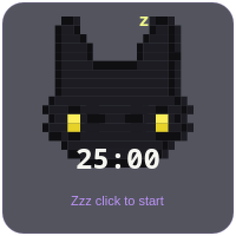
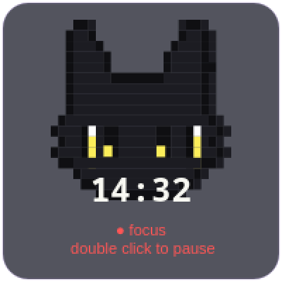
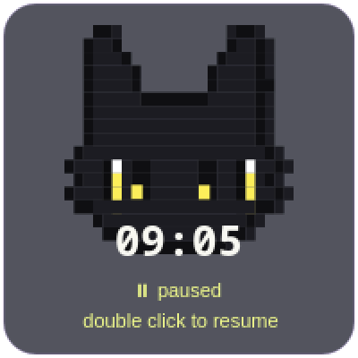
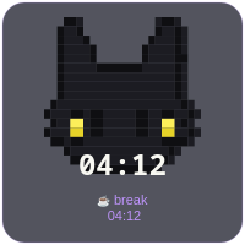

# Pixel Kitten Pomodoro 🐈‍⬛

So... I wanted a pomodoro timer, but every timer I tried felt like being
scolded by a spreadsheet. So I made this instead: a tiny black pixel-art
kitten that just hangs out on your desktop while you work.

The kitten floats on top of everything, naps when you're idle (`Zzz`),
opens its eyes when you focus, and throws a little celebration wiggle when
you finish. That's pretty much the whole pitch: a timer with a roommate.

| Napping (idle) | Locked in (focus) |
|:--------------:|:-----------------:|
|  |  |

| Paused | Break time |
|:------:|:----------:|
|  |  |

## How to pet the cat

| You do this         | The kitten does this            |
|---------------------|---------------------------------|
| Left click          | Starts a 25:00 pomodoro         |
| Double click        | Pauses / resumes                |
| Right click         | Resets (and breaks the streak, oops) |
| Scroll-click twice  | Quits (asks first — very polite) |
| Drag                | Moves somewhere else            |
| `Shift+Click` or `T`| Fakes a finish in 2s (for testing the party) |

When the timer hits zero the kitten plays a soft bell, does a 5-second
happy shake, and starts your 5:00 break right there in the bubble. Pull off
**4 pomodoros in a row and you get upgraded to a 20:00 long break** because
the kitten cares about your back.

## Install

New machine? One line, that's the whole thing:

```bash
uv tool install git+https://github.com/AudelDiaz/kitten-pomo.git
```

(`uv` creates an isolated venv, installs PySide6 for you, and puts both
`kitten-pomo` and `kitten-pomo-stats` on your PATH. No venv juggling, no
`--break-system-packages`. No `uv` yet? Grab it first:)

| Distro / OS | Command |
|------------|---------|
| Arch (you, probably) | `sudo pacman -S uv` |
| macOS | `brew install uv` |
| Anything else | `curl -LsSf astral.sh/uv/install.sh \| sh` |

Prefer the manual route? Clone and run the installer — it uses `uv` when
available (bootstrapping it for you if needed), then `pipx`, otherwise
falls back to a plain copy install:

```bash
git clone https://github.com/AudelDiaz/kitten-pomo.git
cd kitten-pomo
./install.sh            # auto: uv > pipx > copy
./install.sh --copy     # force the plain copy install (needs system PySide6)
# or if you're fancy: make install
```

Either way you get the launcher installed, and your existing history file
is never touched, promise. Details in `docs/paths.md`.

**On GNOME:** the window opens bottom-right and stays on top via Qt's
`WindowStaysOnTopHint`. If it doesn't stay above other windows, hold the
Super (Windows) key and drag it once — Mutter respects Super+drag for
frameless windows. See `packaging/gnome/drag.md`.

Done with the kitten? (Rude, but okay.)

```bash
./uninstall.sh               # keeps your history
./uninstall.sh --purge-data  # forgets you ever met
```

## Will the kitten live on my setup?

It's a Qt app, so the always-on-top part works basically everywhere. The
window-rule snippets just help it sit nicely in the corner:

| Niri | Hyprland | GNOME |
|------|----------|-------|
| ✅ daily-driven | 🧪 untested, send help | ✅ tested (v0.2.0) |

On GNOME the frameless window uses the compositor's native drag
(`startSystemMove()`). It's a frameless window, so there's no title bar —
**press and hold** the left mouse button for ~250 ms, then drag. A quick
click just starts the pomodoro. Details in `packaging/gnome/drag.md`.

See `docs/compositors.md` and `packaging/`.

## The kitten remembers things

Every finished cycle gets logged to `pomodoro.jsonl` (timestamp, type,
duration — that's it, no telemetry, no cloud, it never leaves your disk).
There's an example at `examples/pomodoro.sample.jsonl`.

```bash
kitten-pomo-stats          # streak check + what break is coming next
```

Fun party trick: paste the log to your AI assistant and ask it when you
focus best. The kitten won't tell anyone else, very discreet.

## License

MIT — see `LICENSE`. The kitten is free, the purring is complimentary.
